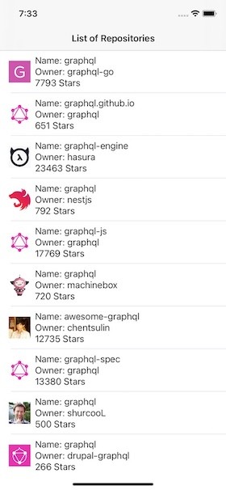

# PeekApp

Peek Asssessment Test.



## App Architecture:
MVVM Architecture + Repository 

## Dependencies of the project:
Pods:
- SDWebImage
- RxSwift
- RxCocoa
- Cucko: for unit testsing mock

SPM:
- Apollo iOS SDK

## Requirements

Make sure you have [Cocoapods](https://cocoapods.org) installed along with Xcode 12.

## Usage
- Clone this repository, branch : develop
- Generate a github personal token for consuming Github GraphQL API [token](https://help.github.com/articles/creating-a-personal-access-token-for-the-command-line/), onces you have your token replace it in Client.swift:

```
final class Client {
  private let token = "<<YOUR TOKEN>>"
}
```

- Run the proyect
- Run unit tests
